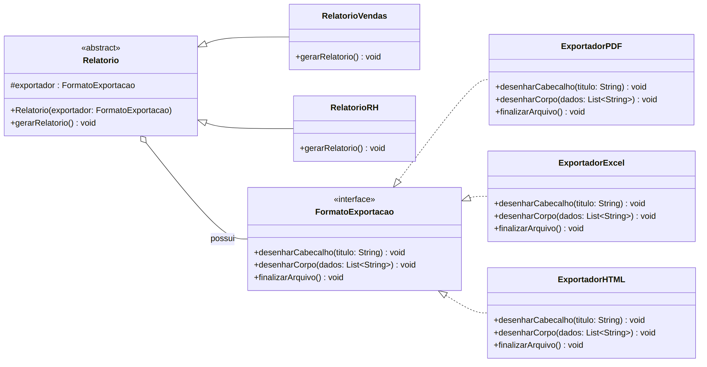
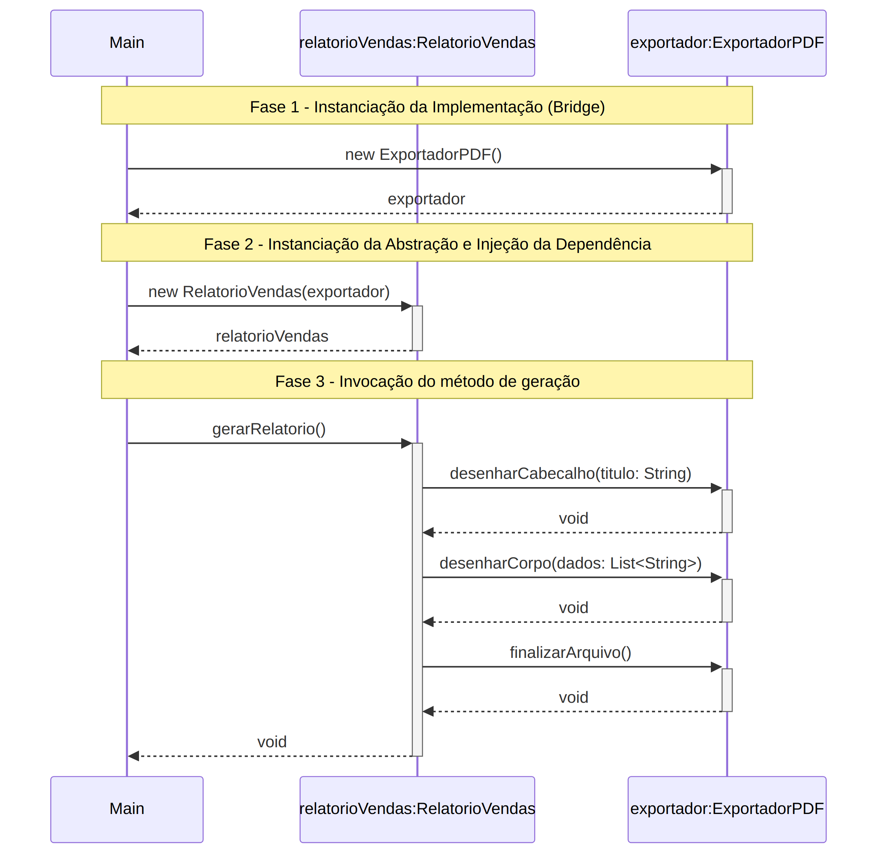

# Módulo de Relatórios TechFatec — Padrão Bridge

Projeto acadêmico (FATEC) que expande o módulo de relatórios de um sistema
de inteligência de negócios fictício, a **TechFatec**. O sistema legado
gerava apenas o **Relatório de Vendas** em **PDF**. Este projeto adiciona o
**Relatório de Desempenho de RH** e torna **todos** os relatórios
(atuais e futuros) exportáveis para **PDF**, **Excel (XLSX)** e **HTML**,
aplicando o **Padrão de Projeto Bridge** para evitar a explosão de
subclasses e respeitar o **Princípio Aberto/Fechado (OCP)** do SOLID.

## Integrantes

- Mariana Ocireu
- Rebeca Matewanga

## Vídeo de defesa técnica

📺 Link do vídeo (3–5 min): **`<< COLOCAR O LINK AQUI >>`**

---

## 1. O problema e por que o Bridge resolve

Sem o Bridge, cada combinação de **tipo de relatório × formato de
exportação** exigiria uma subclasse própria
(`RelatorioVendasPDF`, `RelatorioVendasExcel`, `RelatorioRHPDF`,
`RelatorioRHHTML`, ...). Isso cresce multiplicativamente a cada novo
relatório ou formato adicionado — a chamada "explosão de subclasses".

O Bridge separa duas hierarquias que variam de forma **independente**:

- **Abstração** — *o que é* o relatório (`Relatorio`, `RelatorioVendas`, `RelatorioRH`)
- **Implementação** — *como* ele é exportado (`FormatoExportacao`, `ExportadorPDF`, `ExportadorExcel`, `ExportadorHTML`)

As duas hierarquias se conectam por **agregação/composição**: a
`Relatorio` guarda uma referência a um `FormatoExportacao` e delega a ele
as operações de baixo nível, sem jamais conhecer qual implementação
concreta está por trás da interface.

## 2. Diagrama de Classes



- **Lado da Abstração:** `Relatorio` (abstrata) com o atributo protegido
  `#exportador : FormatoExportacao` e o método `gerarRelatorio()`;
  `RelatorioVendas` e `RelatorioRH` herdam dela.
- **Lado da Implementação:** interface `FormatoExportacao` com
  `desenharCabecalho(titulo: String)`, `desenharCorpo(dados: List<String>)`
  e `finalizarArquivo()`; `ExportadorPDF`, `ExportadorExcel` e
  `ExportadorHTML` a realizam.
- **Relacionamento:** agregação entre `Relatorio` e `FormatoExportacao`
  (losango vazado do lado do todo).

## 3. Diagrama de Sequência



O fluxo mostra a classe cliente `Main`:
1. instanciando um exportador concreto (implementação);
2. injetando essa dependência **pelo construtor** ao criar o relatório (abstração);
3. invocando `gerarRelatorio()`, que internamente delega
   `desenharCabecalho`, `desenharCorpo` e `finalizarArquivo` ao exportador recebido.

---

## 4. Arquitetura de diretórios

```
projeto-bridge/
├── README.md
├── diagramas/
│   ├── diagrama-de-classes.png
│   └── diagrama-de-sequencia.png
└── src/
    ├── abstracao/
    │   ├── Relatorio.java          (classe abstrata)
    │   ├── RelatorioVendas.java    (classe concreta)
    │   └── RelatorioRH.java        (classe concreta)
    ├── implementacao/
    │   ├── FormatoExportacao.java  (interface)
    │   ├── ExportadorPDF.java      (classe concreta)
    │   ├── ExportadorExcel.java    (classe concreta)
    │   └── ExportadorHTML.java     (classe concreta)
    └── cliente/
        └── Main.java               (script de validação)
```

A separação física reflete exatamente a separação lógica do padrão:
tudo que é Abstração fica em `/src/abstracao`, tudo que é Implementação
fica em `/src/implementacao`, e quem orquestra os dois lados
(`Main`) fica isolado em `/src/cliente`.

## 5. Injeção de dependência (regra obrigatória)

**É proibido** instanciar (`new`) um exportador concreto dentro das
classes de relatório. Em todo o pacote `abstracao`, a única forma de uma
`Relatorio` obter um `FormatoExportacao` é recebendo-o **de fora**:

```java
// Relatorio.java — só recebe, nunca cria
protected Relatorio(FormatoExportacao exportador) {
    this.exportador = exportador;
}

public void setExportador(FormatoExportacao exportador) {
    this.exportador = exportador; // permite trocar em tempo de execução
}
```

O `new ExportadorPDF()`, `new ExportadorExcel()` e `new ExportadorHTML()`
só aparecem em **um único lugar do projeto**: na classe cliente
`Main` (`/src/cliente/Main.java`).

## 6. Script de validação (console)

`Main.java` executa, em sequência, as três rotinas exigidas:

1. **Geração de um Relatório de Vendas em PDF** — `new RelatorioVendas(new ExportadorPDF())`.
2. **Alteração dinâmica em tempo de execução do mesmo relatório de vendas
   para Excel** — chama `relatorioVendas.setExportador(new ExportadorExcel())`
   no **mesmo objeto** já criado no passo 1, sem recriar o relatório, e
   gera novamente.
3. **Geração de um Relatório de RH em HTML** — `new RelatorioRH(new ExportadorHTML())`.

### Como compilar e executar

Pré-requisito: JDK 17+ instalado (`javac -version` para conferir).

```bash
# a partir da raiz do projeto
mkdir -p bin
javac -d bin $(find src -name "*.java")
java -cp bin cliente.Main
```

### Saída esperada (resumo)

```
1) Geração do Relatório de Vendas em PDF
[PDF] Cabeçalho renderizado com fonte serifada -> Relatório de Vendas
[PDF]   • Produto A - R$ 12.500,00
...
[PDF] Arquivo finalizado e salvo como relatorio.pdf

2) Troca dinâmica em tempo de execução: PDF -> Excel
[EXCEL] Célula A1 mesclada com o título -> Relatório de Vendas
[EXCEL]   Linha 2: Produto A - R$ 12.500,00
...
[EXCEL] Planilha finalizada e salva como relatorio.xlsx

3) Geração do Relatório de RH em HTML
[HTML] <h1>Relatório de Desempenho de RH</h1>
...
[HTML] Documento finalizado e salvo como relatorio.html
```

---

## 7. Checklist de aderência à atividade

- [x] Classe abstrata `Relatorio` com `#exportador : FormatoExportacao` e `gerarRelatorio()`
- [x] `RelatorioVendas` e `RelatorioRH` herdando de `Relatorio`
- [x] Interface `FormatoExportacao` com as três assinaturas exigidas
- [x] `ExportadorPDF`, `ExportadorExcel`, `ExportadorHTML` realizando a interface
- [x] Agregação correta entre `Relatorio` e `FormatoExportacao`
- [x] Separação física em `/src/abstracao`, `/src/implementacao`, `/src/cliente`
- [x] Nenhum `new` de exportador concreto dentro das classes de relatório
- [x] Injeção via construtor
- [x] Troca dinâmica de formato em tempo de execução, no mesmo objeto
- [x] Script cliente demonstrando as 3 rotinas exigidas
- [ ] Vídeo de defesa técnica gravado e link colado no topo deste README
